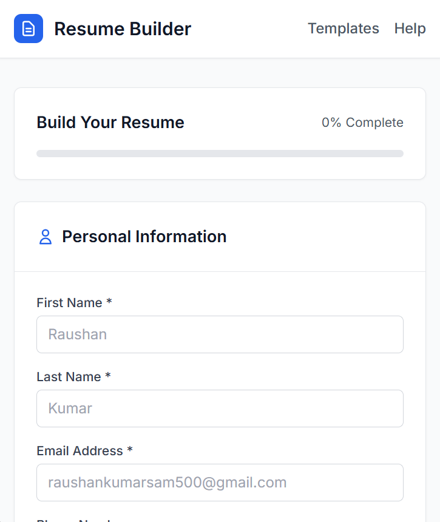
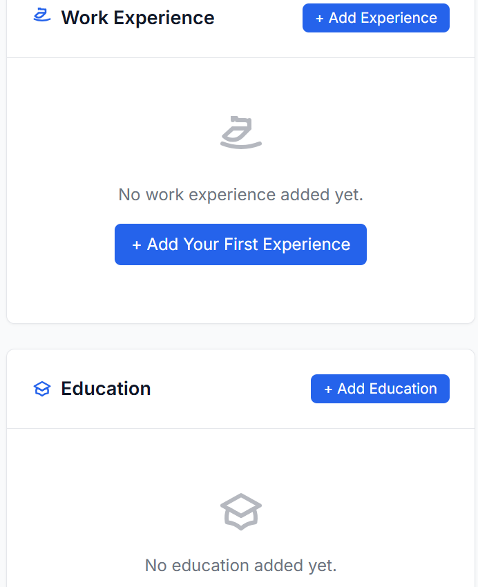

## Digital Resume Builder

A modern, easy-to-use web application for building professional resumes. Instantly create, preview, and download your resume as a PDF. Features a clean UI, auto-updating preview, and customizable sections.

## Features

- Responsive, mobile-friendly design using Tailwind CSS
- Live resume preview as you fill out the form
- Add/remove multiple work experiences and education entries
- Skills section with tag-style display
- Download your resume as a PDF (powered by jsPDF)
- Progress indicator to track completion
- Toast notifications for user feedback

## Getting Started

1. **Clone the repository:**
   ```sh
   git clone https://github.com/yourusername/digital-resume-builder.git
   cd digital-resume-builder
   ```

2. **Open `index.html` in your browser:**
   - No build step required. All dependencies are loaded via CDN.

## Project Structure

```
index.html         # Main application UI
script.js          # Application logic and interactivity
card/
  index.html       # (Reserved for future templates or features)
```

## Usage

- Fill in your personal information, work experience, education, and skills.
- The resume preview updates automatically.
- Click "Download PDF" to save your resume.

## Dependencies

- [Tailwind CSS](https://tailwindcss.com/) (CDN)
- [jsPDF](https://github.com/parallax/jsPDF) (CDN)
- [Google Fonts: Inter](https://fonts.google.com/specimen/Inter)

## Screenshots





